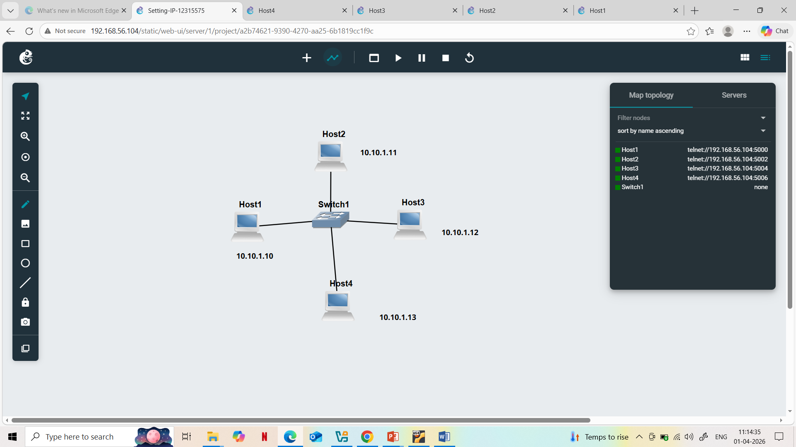
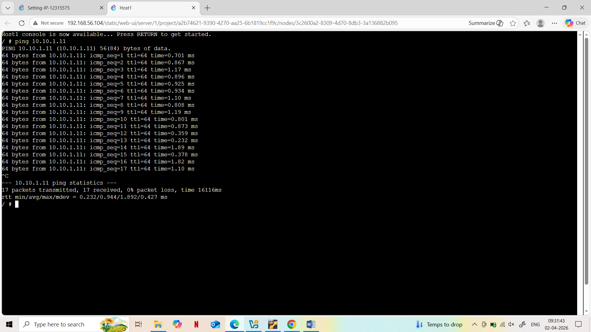
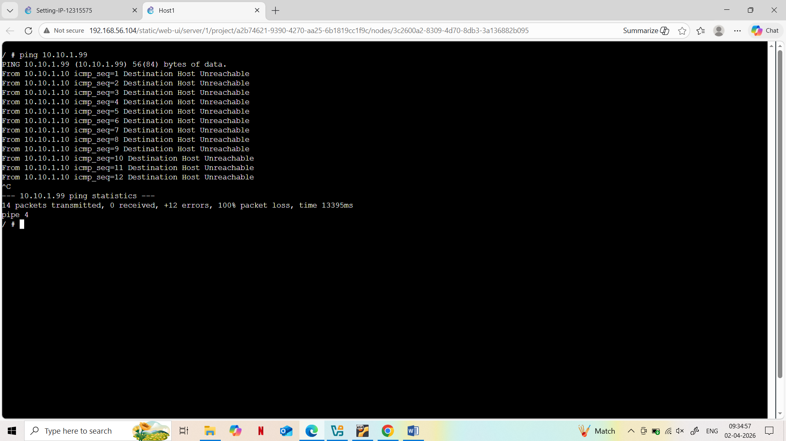
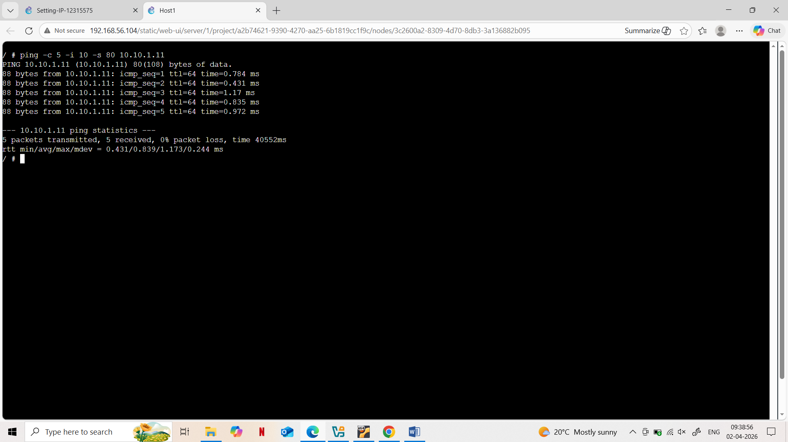

# Setting-IP-12315575

## TASK 1

## Overview
Configure IPv4 addresses in a LAN with 4 Linux hosts and 1 switch using GNS3.

## Setup
- Network: 10.10.1.11
- Host 1 & 2: GNS3 GUI
- Host 3: /etc/network/interfaces
- Host 4: ip address command

## Verification
Checked IPs using `ip address show`.

## Files
- GNS3 project file
- Network topology screenshot
- Host1–Host4 console screenshots

# TASK 2

## Ping Basics - Network Testing

## 1. Basic Ping Test
Command:
ping 10.10.1.11

## 2. Ping to Wrong IP
Command:
ping 10.10.1.99

## 3. Ping with Options
Commands:
ping -c 5 10.10.1.11
ping -i 2 10.10.1.11
ping -s 3 10.10.1.11

.png)

