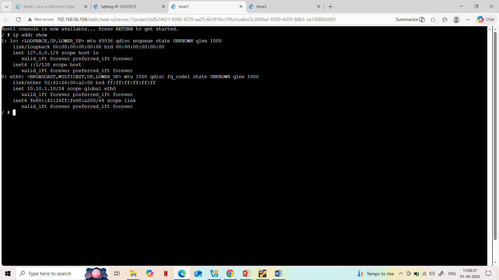
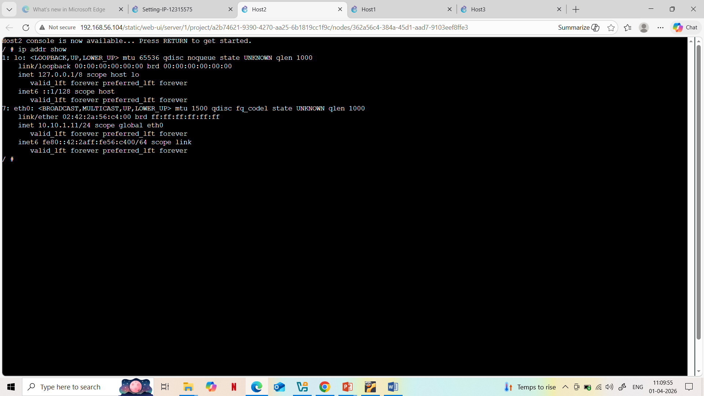
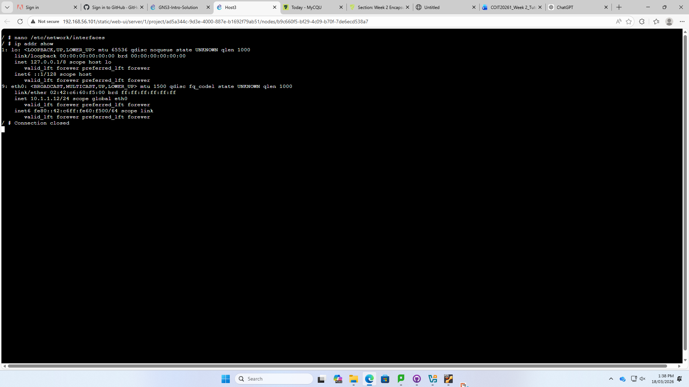
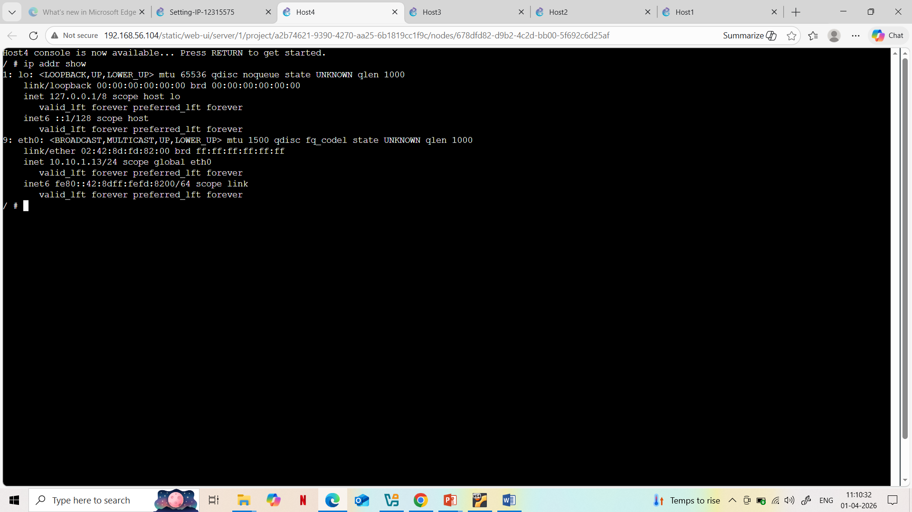

# Setting-IP-12315575

## Overview
Configure IPv4 addresses in a LAN with 4 Linux hosts and 1 switch using GNS3.

## Setup
- Network: 10.1.1.0/24
- Host 1 & 2: GNS3 GUI
- Host 3: /etc/network/interfaces
- Host 4: ip address command

## Verification
Checked IPs using `ip address show`.

## Files
- GNS3 project file
- Network topology screenshot
- Host1–Host4 console screenshots

