# WEEK 4

# View Routes Network Project

## Project File

[GNS3 Project](images/View-Routes-12315575.gn3project)

### Network Topology
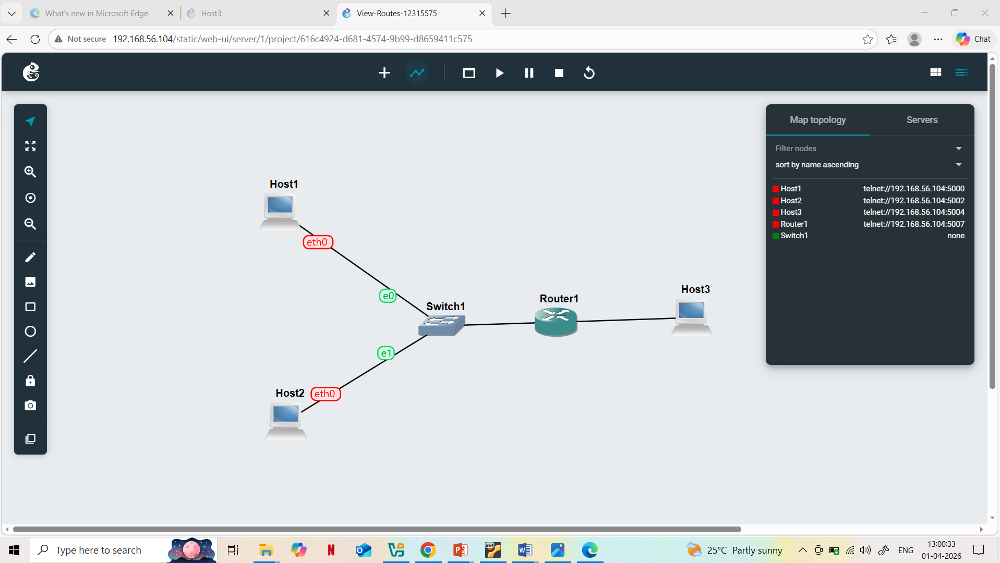

### Ping Tests
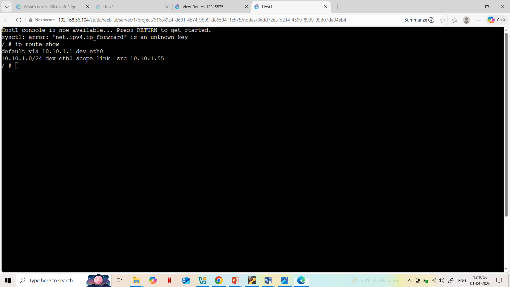  
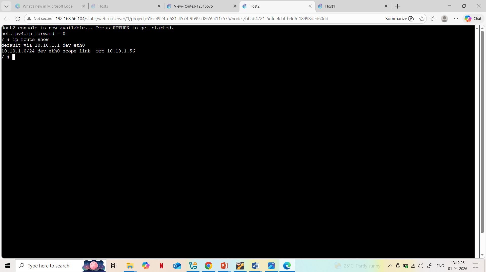  

### Routing Table
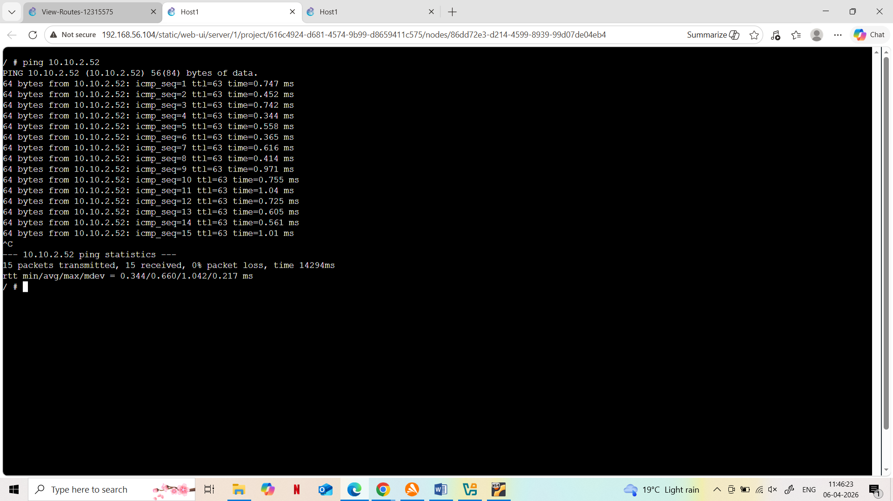

# TASK 2

1.	Exported project

  
  
2.	Screenshot of the network

  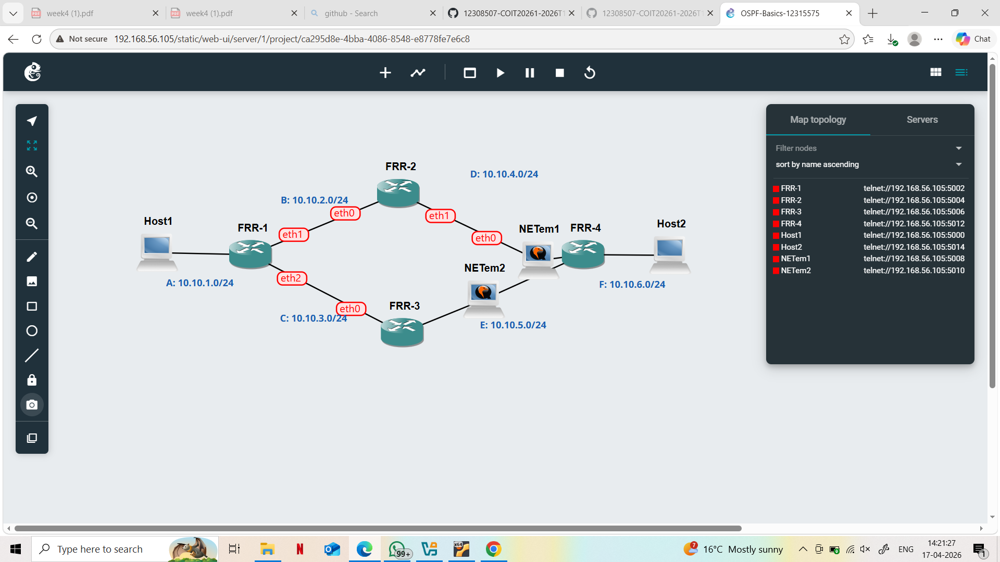
  
3.	Output  showing neigbour routers of FRR1

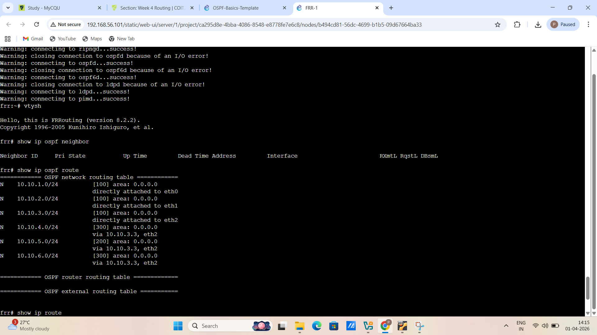
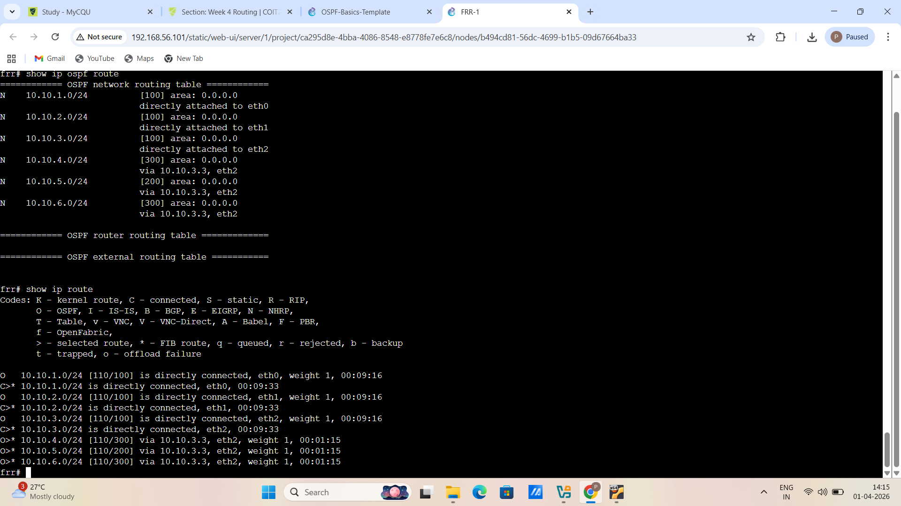)

	  
4.	Output showing routing table for two routers.

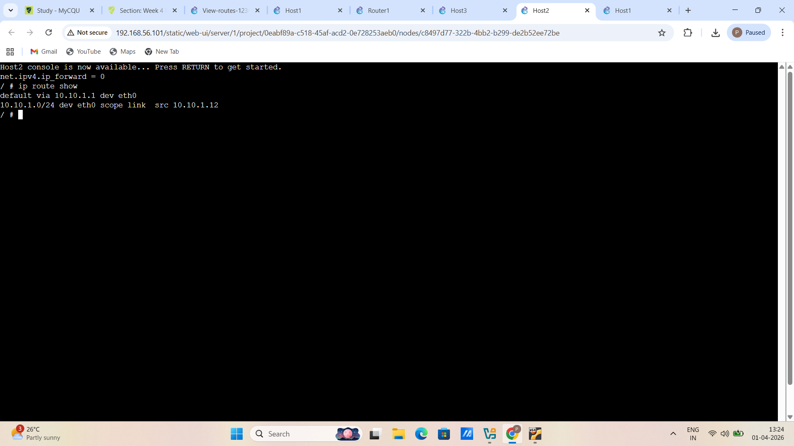
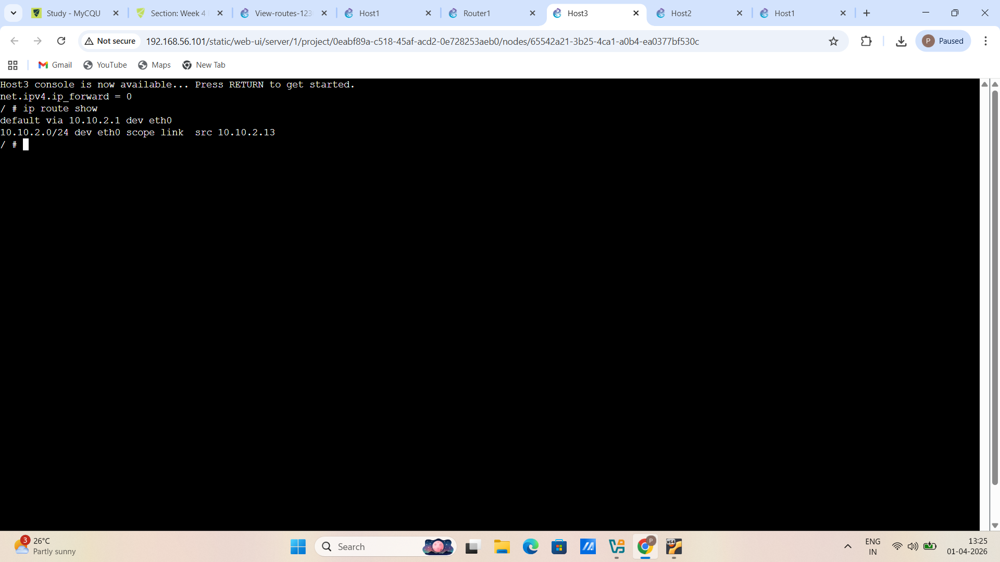
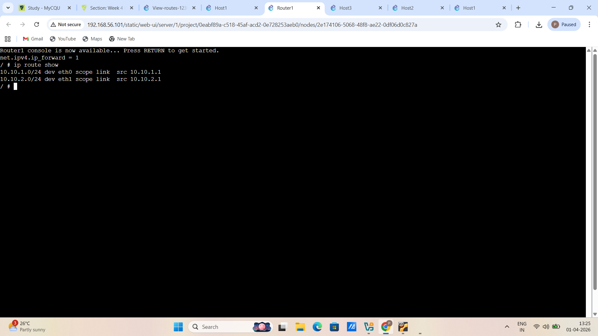

6. output of traceroute:-

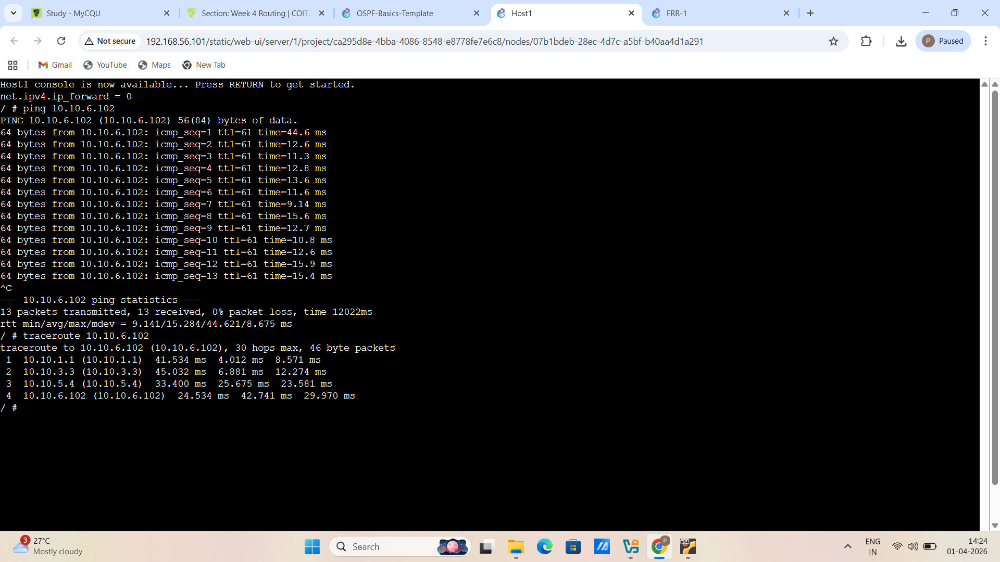
